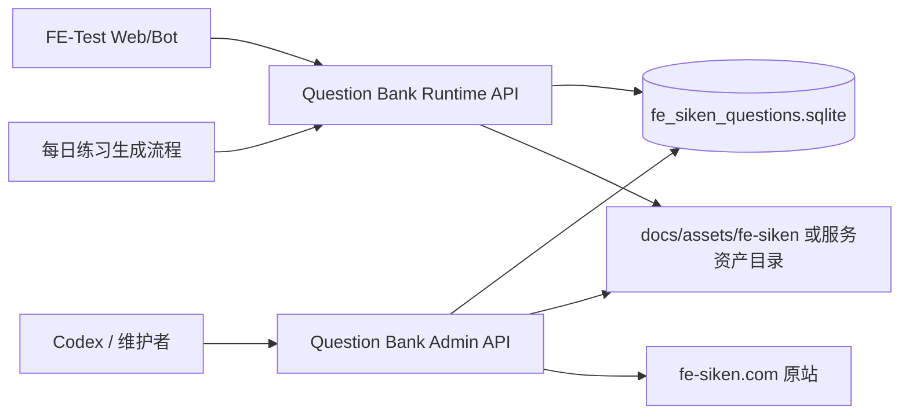

# 系统架构

## 总体结构



## 服务边界

### Runtime API

职责：

- 读取关键词。
- 查询候选题。
- 按 URL 或 ID 读取题目详情。
- 批量读取题目详情。
- 根据调用方需求隐藏或返回答案与解析。

限制：

- 不写 SQLite。
- 不访问原站。
- 不刷新图片。

### Admin API

职责：

- 抓取原站题目详情。
- 解析题干、选项、答案、解析和图片。
- 缓存图片资产。
- 更新 `question_details` 和 `question_assets`。
- 校验格式保真问题，例如指数、上下标、overline。

限制：

- 需要认证。
- 不直接暴露给公网运行流量。
- 写库操作需要事务和互斥控制。

## 模块划分

```text
src/
  app.py
  config.py
  db/
    sqlite.py
    repositories.py
  runtime/
    router.py
    service.py
    schemas.py
  admin/
    router.py
    service.py
    schemas.py
  scraper/
    detail_fetcher.py
    html_parser.py
    asset_cache.py
    validators.py
  tests/
```

## 运行模式

```text
QUESTION_DB_PATH=/app/data/fe_siken_questions.sqlite
QUESTION_ASSET_ROOT=/app/public/assets/fe-siken
QUESTION_BANK_READ_ONLY=true
ENABLE_ADMIN_API=false
ADMIN_API_TOKEN=...
```

MVP 建议使用同一代码库、同一镜像，通过环境变量控制是否启用 Admin API。生产 FE-Test 默认只启用 Runtime API。

## 与 FE-Test 的关系

FE-Test 不应直接知道 SQLite 表结构。建议在 FE-Test 中新增：

```text
QuestionBankProvider
  SqliteQuestionBankProvider
  HttpQuestionBankProvider
```

迁移初期默认仍使用 SQLite Provider；HTTP Provider 验证稳定后再切换生产。

## 与当前维护项目的关系

当前项目可以逐步从“直接查 SQLite + 手动跑脚本”迁移到“调用 Runtime/Admin API”：

- 每日文档生成调用 Runtime API。
- 详情缺失或校验失败时调用 Admin API。
- 解析修复后通过 Admin API 批量校验受影响题目。
